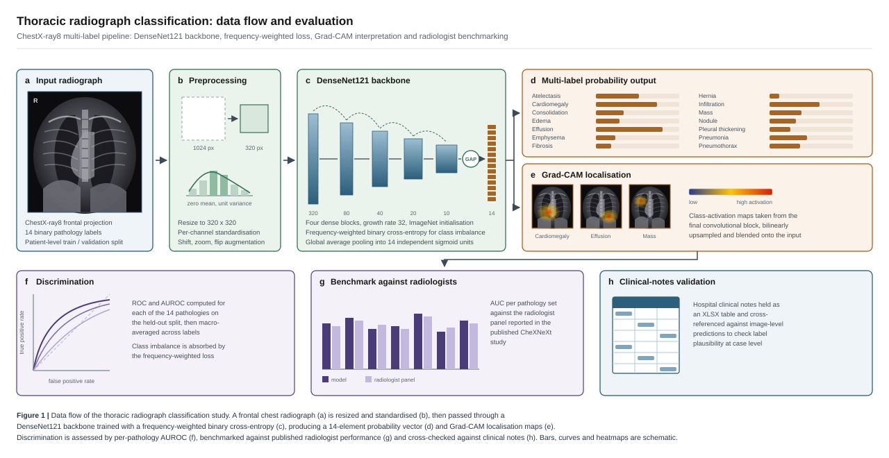

# Thoracic Radiograph Classification with Deep Learning

Multi-label classification of frontal chest radiographs across the fourteen ChestX-ray8 pathology labels, with Grad-CAM interpretation, AUROC benchmarking against published radiologist performance, and a case-level cross-check against hospital clinical notes.

> **Provenance note.** `DensNet121.ipynb` and `Resnet50File_ChestXRay_Medical_Diagnosis_Deep_Learning.ipynb.ipynb` are the programming-assignment notebooks from the *AI for Medical Diagnosis* course; the opening cell reads "Welcome to the first assignment of AI for Medical Diagnosis!". They are retained here as working copies and are not original implementations. The original material in this repository is the AUC benchmarking figure, the graphical abstract and the clinical-notes cross-validation against the hospital dataset.

## Architecture

*Figure 1. Vector block diagram of the pipeline: input radiograph, preprocessing, DenseNet121 backbone, 14-element probability vector, Grad-CAM localisation, and the three evaluation routes. Bars, curves and heat maps in the figure are schematic rather than measured.*

## Label set

Fourteen binary labels are predicted independently: atelectasis, cardiomegaly, consolidation, edema, effusion, emphysema, fibrosis, hernia, infiltration, mass, nodule, pleural thickening, pneumonia and pneumothorax. Five of these - consolidation, edema, effusion, cardiomegaly and atelectasis - carry consensus annotation from four radiologists in the source dataset.

## Method

**Data handling.** Radiographs are split at patient level, with an explicit leakage check that no patient identifier appears in more than one partition. Images are resized to 320 x 320 and standardised per channel to zero mean and unit variance; random shift, zoom and horizontal flip provide augmentation.

**Model.** A DenseNet121 backbone (four dense blocks, growth rate 32, ImageNet initialisation) is truncated after the final convolutional block, reduced by global average pooling and mapped to fourteen independent sigmoid units. Because the label distribution is heavily skewed, the objective is a frequency-weighted binary cross-entropy in which the positive and negative contributions for each label are reweighted by their empirical class frequencies.

**Evaluation.** Discrimination is reported as the ROC curve and AUROC for each pathology on the held-out split, then macro-averaged. A separate notebook places per-pathology AUC alongside the radiologist-panel values reported in the published CheXNeXt study; those comparison values are transcribed from the publication and are not measured here.

**Interpretation.** Grad-CAM maps are computed from the final convolutional block, bilinearly upsampled to input resolution and alpha-blended over the radiograph, giving a coarse spatial account of which region drove each positive prediction.

**Clinical cross-check.** A hospital clinical-notes table is held as an XLSX file and cross-referenced against image-level predictions to assess whether the predicted labels are plausible at case level.

## Repository contents

| Path | Role |
| --- | --- |
| `DensNet121.ipynb` | Course notebook: data loading, leakage check, class weighting, DenseNet121, AUROC and Grad-CAM |
| `Resnet50File_ChestXRay_Medical_Diagnosis_Deep_Learning.ipynb.ipynb` | Course notebook on model interpretation methods |
| `AUC_values_for_the_CheXNeXt_model_and_radiologists_on_the_dataset.ipynb` | Per-pathology AUC comparison figure |
| `Clinical_Validation_on_image_datas.ipynb` | Cross-check of predictions against the clinical-notes table |
| `Transformative_Insights_in_Pulmonary_Radiography_AI_Enabled_Innovations.ipynb` | Main study notebook |
| `Hospital_Clinical_Notes_Dataset.xlsx` | Clinical-notes table used for the case-level cross-check |
| `Graphical_Abstract (1).ipynb` | Matplotlib graphical abstract |
| `docs/architecture.svg` | Vector source for Figure 1 |

## Known limitations

- `Transformative_Insights_in_Pulmonary_Radiography_AI_Enabled_Innovations.ipynb` and `Clinical_Validation_on_image_datas.ipynb` do not render on GitHub. Both fail with a missing `state` key under `metadata.widgets`, a notebook-metadata defect rather than a code fault.
- One filename carries a doubled `.ipynb.ipynb` extension, and its name refers to ResNet50 although the content covers interpretation methods.
- No environment specification, trained weights or image data are committed. The notebooks expect the course-supplied weight file and sample images.
- No measured performance figures are quoted in this README, because the committed notebooks do not record a documented evaluation split.

## Roadmap

1. Strip `metadata.widgets` from the two affected notebooks so they render on GitHub.
2. Separate the course material from the original analysis into distinct directories with explicit attribution.
3. Add `requirements.txt` and a data stub documenting how to obtain the source radiographs.
4. Report measured per-pathology AUROC with confidence intervals on a documented, reproducible split, alongside the published comparison.
5. Extend the clinical-notes cross-check into a quantitative agreement analysis rather than a qualitative inspection.

## Related repositories

- `High-Throughput-Multimodal-AI-Fusion-of-OCT-` - multimodal fusion for retinal imaging.
- `Structured-Caption-Supervision-for-Domain-Adaptive-Vision-Language-Learning-` - dermoscopy classification with vision-language supervision.
- `medical-image-analysis` - segmentation-quality metrics dashboard.

## Licence

No licence has been declared for this repository. The two course notebooks remain subject to the terms of their original source.

## Author

Md Abu Sufian - ORCID [0009-0007-3503-6942](https://orcid.org/0009-0007-3503-6942)
